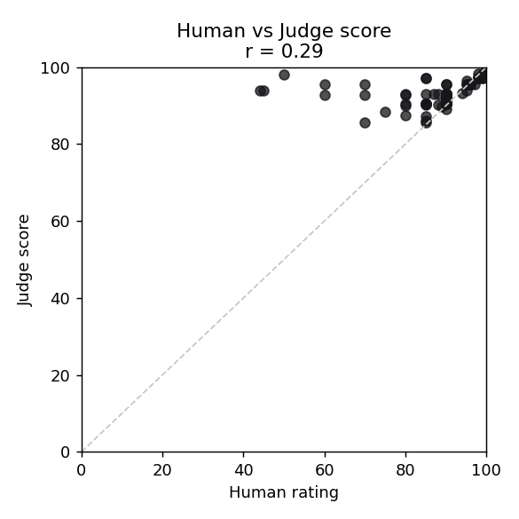
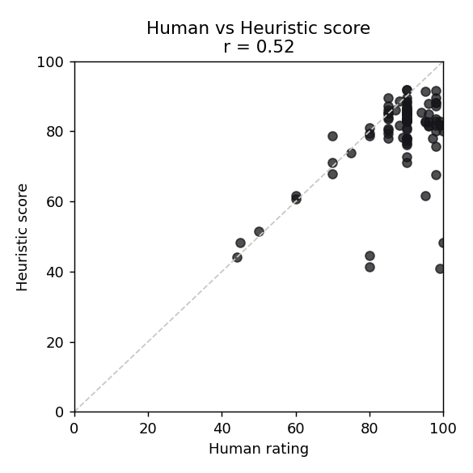

# Prism

**A multi-model prompt console with a calibrated evaluation harness.**
Write one request, run it across several LLMs at once, and compare the answers
side by side — with live latency, token, and cost readouts, plus quality scores
whose reliability has been *measured against human judgment*.


---

## Why this exists

Choosing an LLM for a task is usually done by vibes. Prism turns it into
something you can see and measure: the same prompt, optimized per model, answered
in parallel, with cost and latency exposed — and a quality score you can actually
trust, because it was validated against 93 human ratings rather than assumed.

## Highlights

- **Real-time multi-model streaming** — one prompt fans out to several models
  concurrently and streams into side-by-side columns. A slow or failing model
  never blocks the others.
- **Per-model prompt optimization** — each request is transformed into a
  model-specific prompt; the exact prompt each model received is inspectable.
- **Live metrics** — latency, input to output tokens, and cost per response.
- **A validated evaluator** — a Python service scores each response, and the
  scoring was *calibrated against human ratings* (see results below).
- **Workspace UI** — a conversation-style composer at the bottom, a saved
  history of past runs (click any to reload the full comparison), and a
  light / warm-dark theme toggle.
- **Provider-agnostic** — runs on free OpenRouter models out of the box; any
  OpenAI-compatible endpoint (OpenRouter, Groq, native OpenAI) is a config change.

---

## Architecture

```
            +--------------+     POST /api/chat (SSE)     +-----------------+
            |   client     | ---------------------------> |    gateway      |
            | React + Vite | <--------------------------- | Node + Express  |
            +--------------+     streamed token events     +--------+--------+
                                                                    | concurrent fan-out
                                        +---------------+-----------+-------+
                                  +-----v-----+   +-----v-----+   +---------v---------+
                                  | model A   |   | model B   |   |  eval-service     |
                                  | (stream)  |   | (stream)  |   |  FastAPI scoring  |
                                  +-----------+   +-----------+   +-------------------+
```

| Layer           | Stack                              | Responsibility                                         |
| --------------- | ---------------------------------- | ------------------------------------------------------ |
| `client/`       | React, Vite, TypeScript, Tailwind  | Console UI, side-by-side streaming columns, theming    |
| `gateway/`      | Node, Express, TypeScript          | Prompt optimization, concurrent fan-out, SSE streaming |
| `eval-service/` | Python, FastAPI                    | Response scoring (heuristics + optional LLM judge)     |
| `lab/`          | Python (pandas/numpy/matplotlib)   | Calibration: batch runner + human-rating analysis      |

The gateway and client are the core; the eval service is optional (if it's down,
quality scores degrade to a dash and nothing else breaks).

---

## Quick start

**Prerequisites:** Node 18+, and Python 3.10+ for scoring.

```bash
npm install                 # installs client + gateway
copy .env.example .env      # Windows  (cp on macOS/Linux)
```

Prism runs on **free OpenRouter models** by default — one key, no credit card:

1. Get a key at https://openrouter.ai then Keys then Create Key.
2. Paste it into `.env` after `OPENROUTER_API_KEY=`.
3. Run it:

```bash
npm run dev                 # client on :5173, gateway on :8787
```

Open http://localhost:5173, write a request, pick models, hit **Run**.

> Free model IDs on OpenRouter rotate. If a column says "model not found", grab a
> current `:free` slug from https://openrouter.ai/models and paste it as that
> slot's `id` in `gateway/src/config.ts`.

Optional quality scoring (separate terminal):

```bash
cd eval-service
python -m venv .venv
.venv\Scripts\python.exe -m pip install -r requirements.txt
.venv\Scripts\python.exe -m uvicorn app.main:app --port 8000
```

---

## Evaluation & calibration

The interesting part. Rather than assume the quality scores are meaningful, I
validated them: I hand-rated **93 responses** (0-100) across five task types —
including an adversarial set of false-premise, trick, and constraint prompts
designed to make weaker answers fail — and measured how well the automated scores
agreed with my ratings.

**Headline finding: the LLM judge's reliability is strongly task-dependent.**

| Task     | Judge vs human (r) | Judge (rho) | Heuristic (r) | Top model (human avg) |
| -------- | :----------------: | :---------: | :-----------: | --------------------- |
| general  | **0.88**           | 0.83        | 0.29          | Nemotron 3 Super (93.0) |
| support  | **0.90**           | 0.96        | 0.40          | GPT-OSS 120B (92.2)   |
| research | 0.51               | 0.44        | 0.63          | Gemma 4 31B (90.0)    |
| coding   | 0.41               | 0.69        | 0.55          | GPT-OSS 120B (90.8)   |
| content  | 0.16               | 0.41        | 0.50          | Nemotron 3 Super (85.5) |
| **overall (n=93)** | **0.29** | **0.60**  | **0.53**      | GPT-OSS 120B (89.4)   |

What this shows:

- The judge tracks human judgment **closely on factual/structured tasks**
  (general r=0.88, support r=0.90, rho=0.96) but **poorly on open-ended content**
  (r=0.16) — it over-rewards fluent-but-generic copy, a known LLM-judge failure.
- Aggregated, the judge's **rank** correlation holds (rho=0.60) while its linear
  correlation is modest (r=0.29): it **orders** responses well but **compresses**
  absolute scores. It's a better *relative ranker* than *absolute scorer*.
- The lexical heuristics are the mirror image — decent linear fit (r=0.53),
  weak ranking (rho=0.23) — strongest where length/structure are good proxies.
- By human rating the three models were close (89.4 / 87.9 / 87.0), but the
  **winner shifts by task** — exactly the case for choosing models per-task
  rather than globally.

<p align="center">
  
  
</p>

*Per-task samples are small (n=16-24, indicative); the overall n=93 figures are
the firm claims. Calibration was run on the trio GPT-OSS 120B / Nemotron 3 Super
/ Gemma 4 31B; free-tier availability rotates, so the live app's default lineup
may differ (e.g. Nex N2 Pro in place of Nemotron). Models are a one-line swap in
`gateway/src/config.ts`.*

### Reproduce it

```bash
pip install -r lab/requirements.txt
python lab/run_batch.py --judge --prompts lab/prompts_hard.json --out lab/results_hard.csv
# fill the human_overall column in the CSV, then:
python lab/analyze.py --csv lab/results.csv lab/results_hard.csv
```

---

## How it works

1. **Transform** — `gateway/src/prompts/library.ts` builds a model-specific
   `{ system, user }` prompt from the task type and request.
2. **Fan out** — `gateway/src/routes/chat.ts` launches every selected model
   concurrently and streams tokens back over SSE, tagged by model.
3. **Measure** — on completion, latency and cost are computed from real token
   usage and emitted as a `done` event.
4. **Score** — the finished response is sent to the eval service; scores arrive
   as an `eval` event.

Models and prices live in one file (`gateway/src/config.ts`) — swapping a model
is a one-line change. Run history and theme are stored in the browser
(localStorage), so they persist per device.

---

## Deployment

Prism is deploy-ready: the gateway runs as a long-lived streaming server (Render
free tier) and the frontend deploys as a static build (Vercel), wired together by
a `VITE_API_BASE` env var. Step-by-step instructions, env values, and
troubleshooting are in **[DEPLOYMENT.md](DEPLOYMENT.md)**.

---

## Tech stack

React, Vite, TypeScript, Tailwind, Node, Express, Server-Sent Events,
Python, FastAPI, pandas / numpy / matplotlib, OpenRouter (OpenAI-compatible).

## Project structure

```
prism/
  client/          React + Vite frontend (the console UI, theming, history)
  gateway/         Node/Express gateway (prompt optimization, fan-out, SSE)
  eval-service/    FastAPI scoring service (heuristics + LLM judge)
  lab/             Calibration toolkit (batch runner + analysis)
  DEPLOYMENT.md    Render + Vercel deployment guide
  README.md
```

## Notes for reviewers

This project is scoped around two pieces of depth rather than breadth:

- **Systems:** concurrent multi-provider streaming over SSE with per-model
  partial-failure isolation, a unified provider interface, a server-side cost
  guard, and a provider-agnostic design (any OpenAI-compatible endpoint).
- **ML/evaluation:** a scoring harness that separates a deterministic baseline
  from an LLM judge, and — critically — was **calibrated against human ratings**,
  surfacing where the judge is and isn't reliable.

## Roadmap

- Widen the calibration set further to firm up per-task estimates
- Run-history persistence across devices and an in-UI results/export view
- Multi-judge agreement (inter-rater reliability between judge models)
- KaTeX rendering for math-heavy responses